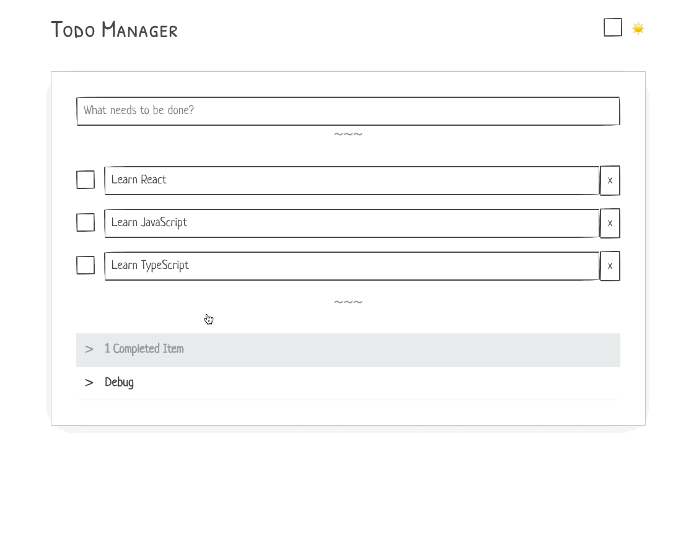

# Introduction

In this tutorial you'll learn how to develop a basic application using React. You will get to know the building blocks to have a working application: modules, components, utils and hooks. Create React App will help you behind the scenes to serve your app in the browser and compile everything on every key press so you'll get excellent developer experience. You'll also learn [TypeScript](http://www.typescriptlang.org/docs/home.html), which is just JavaScript with types, so you can be almost sure that your app won't contain any runtime errors 💪.

## React

React is a JavaScript library for building user interfaces for various platforms.

[Learn more](https://reactjs.org/)

### Workshop skills prerequisites 👀:

- Basic familiarity with HTML & CSS.
- Basic knowledge of JavaScript and programming.
- Basic understanding of the DOM.
- Familiarity with ES6 syntax and features.

> ℹ️ If you don't have all of those all just few, you should be still ok, you have your awesome mentor! yay ⚡️

### Workshop Outline

Here are the topics we'll be covering:

- Create DOM with JavaScript, React, and JSX
- Create Custom Components
- Styling
- Simple Forms (form submission)
- Controlled and Uncontrolled Forms (form state management)
- Conditional Rendering
- Rendering Lists of Data
- React hooks
- Browser API (LocalStorage)

## Our goal

By the end of this tutorial, you'll have a ready todo-list application, that shows a list of items and lets you add or delete items. You will even be able to change the title of an existing item.

The list will be saved in the browser's local storage. All the changes will remain even when you refresh the browser or even turn off your computer (as long as you use the same browser on the same computer and not in private mode).

As an extra touch, our app will enable fancy dark mode as well!

You will even publish the application on the Web, so that others can use it!

This is gonna be fun !

> ## What if I'll finish sooner ?
>
> After completing this tutorial, we encourage you to continue developing the application and adding your personal touch.
>
> This tutorial is meant for beginners. As such it tries to address good practices, but due to its simplicity, it's not always possible.
>
> We really hope this tutorial will help you in your first stages of Web development using React!

---

[🚀 Let's setup our environment !](./1-setting-env.md)
