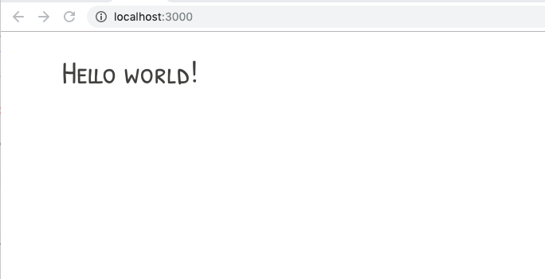

# Environment setup

## System Requirements

- [git][git] v2 or greater
- [NodeJS][node] v10 or greater
- [yarn][yarn] v1 or greater (or [npm][npm] v6 or greater)
- browser (Google Chrome is preferred)
- IDE/Editor ([VSCode](https://code.visualstudio.com/Download) is preferred)

All of these must be available in your `PATH`. To verify things are set up
properly, you can run this:

```shell
git --version
node --version
yarn --version # or npm --version
```

If you have trouble with any of these, learn more about the PATH environment
variable and how to fix it here for [windows][win-path] or
[mac/linux][mac-path].

## Setup

You should be able to work through the entire workshop in the browser. This is
actually the recommended approach as it requires absolutely no setup whatsoever.

Go to
[this codesandbox](https://codesandbox.io/s/github/ngParty/react-todo-app)
and you should be good to go.

[](https://codesandbox.io/s/github/ngParty/react-todo-app)

If you'd rather be able to work through the workshop on your own computer, then
follow the following instructions.

After you've made sure to have the correct things (and versions) installed, you
should be able to just run a few commands to get set up:

```sh
git clone https://github.com/ngParty/react-todo-app.git

npm install
```

This may take a few minutes. You may also want to look
at [Troubleshooting](#troubleshooting). If you can't work it out on your own
then please ask your mentor for help.

## Running the app

To get the app up and running run:

```sh
npm start
```

This should start up your browser. It uses standard
[react-scripts](https://github.com/facebook/create-react-app) application under the hood.

## Running the tests (Optional)

```sh
npm test
```

This will start [Jest](http://facebook.github.io/jest) in watch mode.

## Result

You should see following screen within your browser.



You did it, you're all set and your app works !

---

[🚀 Let's explore our app scaffolding !](./2-app-structure.md)

[npm]: https://www.npmjs.com/
[node]: https://nodejs.org
[git]: https://git-scm.com/
[yarn]: https://yarnpkg.com/
[win-path]: https://www.howtogeek.com/118594/how-to-edit-your-system-path-for-easy-command-line-access/
[mac-path]: http://stackoverflow.com/a/24322978/971592
