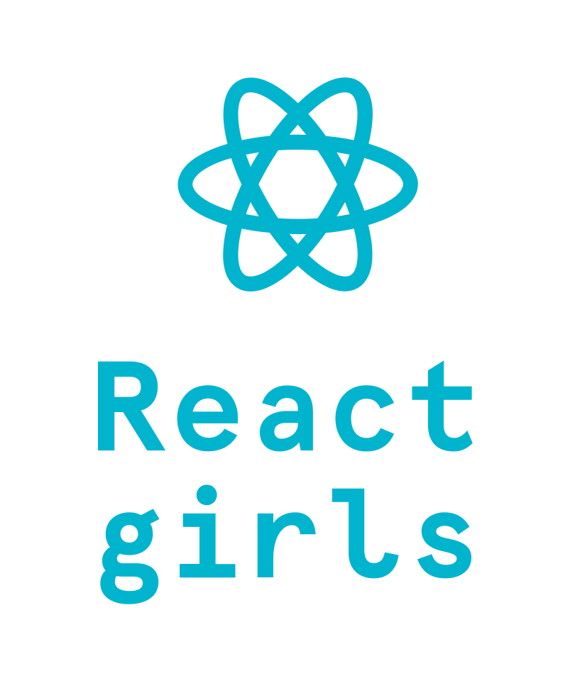

# Workshop Guide

  

Hello and welcome to React Girls workshop ⚛️!

This tutorial will take you step by step on how to create your own todo list application using React and TypeScript.

> At the moment, it's not possible to complete this without a mentor as it lacks thorough explanation of every step. Actually, that's what your mentors are here for, right? 🤗

[🚀 Let's start !](./0-introduction.md)

### Contributing

This tutorial is open source and is written by the community.

Please feel free to send any suggestions and pull requests. Special thanks to [Edupunk.cz](https://edupunk.cz) and [ngParty](http://ngparty.cz) for kickstarting this initiative!

The tutorial is used in the ReactGirls workshops. You are welcome to use it in your own workshop and we'd love to hear about it! Write to us: `info@ngParty.cz`
